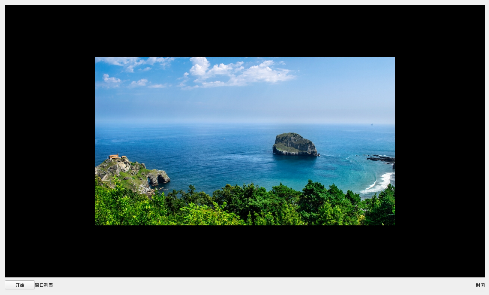

*-*-*-*
我以负责任的态度考虑项目的功能和架构，但并不能保证总是有充沛的时间持续地更新或维护。分支这个项目不需要向我说明，我会以开放的心态倾听意见，但仍然坚持我的批判性思考和偏好。
*-*-*-*

TestWM
=======

空闲时间鼓捣的桌面环境。RP不会被处理，很多东西我还没想清楚。

明确的事情
---------

* 使用xfwm4作为窗口管理器
* 重视加密
* 图形界面是核心的
* 使用qt + qtcreator 开发
* MIT许可证/免费

下一步：

* 完成整体功能的梳理和架构的设计
* 有空的时候编码

安装和编译
--------

需要安装 qt,qtcreator以及libkf5windowsystem-dev,libkf5screen-dev 。网上有教程或可apt-get安装。

截图
----

